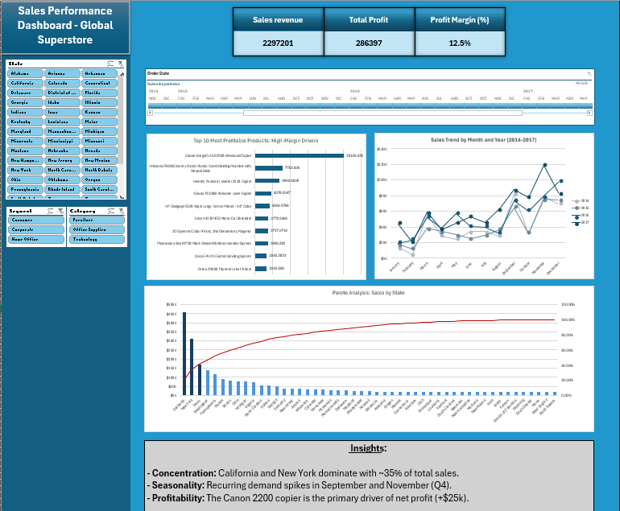

# Global Superstore: Strategic Sales & Profitability Analysis 📊

## 📌 Project Overview
This project features an interactive Excel Dashboard designed to analyze the sales performance and profitability of the **Global Superstore** (2014-2017). The analysis focuses on identifying high-impact geographic markets, seasonal demand patterns, and profitability risks to support data-driven business decisions.

## 🖥️ Interactive Dashboard
Below is the visual representation of the final dashboard. It includes dynamic slicers for **Category**, **Segment**, and **Region**, allowing for real-time data exploration.

---

## 💡 Key Business Insights

### 1. Market Penetration vs. Population Density 👥
* **Observation:** Sales in top states like California, New York, and Texas strongly align with high population counts.
* **The 80% Threshold:** According to the **Pareto Principle**, the top 80% of total revenue is concentrated in only 15 states, concluding with **Arizona**.
* **The Washington Exception:** Washington significantly outperforms its population rank (#13), suggesting exceptional market penetration in the Pacific Northwest.

### 2. Seasonal Inventory Strategy (Q4 Focus) 📈
* **Trend Analysis:** Consistent revenue spikes are observed every September and November.
* **Year-over-Year Growth:** Comparing Q4 periods from 2014 to 2017 confirms a steady upward trend in year-end demand.
* **Action Plan:** Supply chain teams should begin inventory ramp-up in August to prevent stockouts during the September-November peak.

### 3. Profit Concentration Risk 💎
* **The "Hero Product" Risk:** A significant portion of net profit is driven by a single SKU: the **Canon imageCLASS 2200** copier (+$25k profit).
* **Strategic Recommendation:** To mitigate risk, the business should diversify its high-margin product portfolio and reduce over-reliance on a single manufacturer.

---

## 🛠️ Methodology & Tools Used
* **Data Cleaning:** Processed raw data using **Power Query** to handle duplicates, null values, and date formatting.
* **Data Modeling:** Built complex **Pivot Tables** to aggregate sales by state, month, and product category.
* **Advanced Analytics:** Applied the **Pareto Principle (80/20 Rule)** to prioritize geographic market focus.
* **Visualization:** Developed a custom UI/UX in Excel using **Slicers**, **Dynamic Charts**, and a cohesive color palette for executive reporting.

---

## 📂 Repository Structure
* **[Global_Superstore_Analysis_Dashboard.xlsx](Global_Superstore_Analysis_Dashboard.xlsx)**: The final interactive Excel file.
* **[Executive_Report_Global_Superstore.pdf](Executive_Report_Global_Superstore.pdf)**: Executive summary in PDF format.
* `/screenshots`: Folder containing high-resolution images of the analysis.

---
**Author:** Italo Fernando Martin Yupan Artica  
*Data Analytics Portfolio - 2026*
